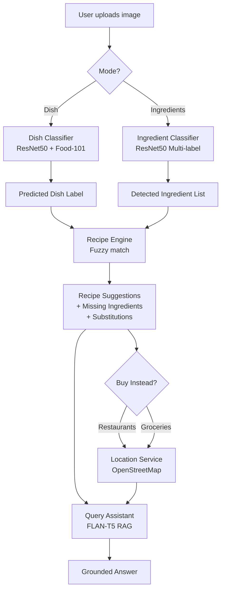

# 🍳 SmartKitchen: A Vision-Language Cooking Assistant


A multimodal AI application that combines **computer vision**, **generative language modelling**, **structured recipe retrieval**, and **location-aware recommendations** to help users decide what to cook or where to buy food.

> **MSc Deep Learning Coursework Project**

---

## ✨ Features

- 🍝 **Dish Recognition**  
  Identify prepared meals using **ResNet50 trained on Food-101**.

- 🧺 **Ingredient Detection**  
  Multi-label classification of pantry ingredients.

- 📖 **Recipe Recommendation Engine**  
  Retrieves recipes from a **2,000+ recipe database** using ingredient overlap scoring.

- 🤖 **Query Assistant (RAG)**  
  Powered by **FLAN-T5** to answer cooking questions using system context.

- 📍 **Location Awareness**  
  Suggest nearby **restaurants** or **grocery stores** using **OpenStreetMap**.

- 🖥 **Interactive Interface**  
  Built with **Streamlit** for fast experimentation and demos.

## Architecture



---

## Dataset Setup

The Food.com dataset is **not included in this repository** due to file size. You must download it manually before running the app.

### Download from Kaggle

**[Food.com Recipes and User Interactions](https://www.kaggle.com/datasets/shuyangli94/food-com-recipes-and-user-interactions)**

Download and extract the archive, then place all files under `data/foodcom/` as shown below.

### Expected folder structure

```
data/
└── foodcom/
    ├── PP_recipes.csv              # Pre-processed recipes (~195 MB)
    ├── PP_users.csv                # Pre-processed user data
    ├── RAW_recipes.csv             # Raw recipe data (~280 MB)
    ├── RAW_interactions.csv        # Raw user interactions (~333 MB)
    ├── ingr_map.pkl                # Ingredient ID mapping (pickle)
    ├── interactions_train.csv      # Train split
    ├── interactions_validation.csv # Validation split
    └── interactions_test.csv       # Test split
```

> `data/foodcom/` is listed in `.gitignore` and will never be committed to the repo.

---

## Quick Start

### 1. Install dependencies

```bash
cd smartkitchen
pip install -r requirements.txt
```

### 2. Run the Application

```bash
streamlit run app/streamlit_app.py
```

The app loads **trained ResNet50 models** for both dish and ingredient recognition. The system draws from a database of 2,000+ recipes and location-aware services for nearby recommendations.

### 3. Training & Evaluation (Optional)

If you wish to retrain the models:

**Dish classifier** (Food-101 ~5 GB):
```bash
python training/train_dish.py --epochs 10 --subset-size 10 --batch-size 32
```

**Ingredient classifier**:
```bash
python training/train_ingredients.py --epochs 15 --batch-size 32
```

**Run evaluation suite**:
```bash
python training/evaluate.py --component all
```

---

## Project Structure

```
smartkitchen/
│
├── app/
│   └── streamlit_app.py          # Streamlit interface
│
├── data/
│   ├── recipes.json              # 2,026 recipes with substitutions
│   ├── substitutions.json        # 54 ingredient substitution rules
│   ├── food101/                  # Food-101 dataset (auto-downloaded)
│   ├── grocery_dataset/          # Expanded ingredient dataset
│   └── pantry_images/            # Custom ingredient dataset
│
├── models/
│   ├── dish_classifier.py        # ResNet50 dish recognition
│   ├── ingredient_classifier.py  # ResNet50 multi-label ingredient detection
│   └── query_assistant.py        # FLAN-T5 RAG query assistant
│
├── training/
│   ├── train_dish.py             # Dish classifier training
│   ├── train_ingredients.py      # Ingredient classifier training
│   └── evaluate.py               # Full evaluation suite
│
├── utils/
│   ├── recipe_engine.py          # Recipe retrieval & ranking
│   ├── retrieval.py              # Context retrieval for RAG
│   ├── location_service.py       # Nearby restaurants/groceries (Overpass API)
│   └── prompt_builder.py         # Prompt template builder
│
├── outputs/
│   ├── saved_models/             # Trained model checkpoints (.pth)
│   ├── plots/                    # Evaluation metrics
│   └── predictions/              # Sample outputs
│
├── requirements.txt
└── README.md
```

---

## 📸 System Demo

| Dish Recognition | Ingredient Recognition |
|-----------------|-----------------------|
| Identify prepared meals | Detect pantry ingredients |
| Retrieve recipe | Suggest meals you can cook |
| Find nearby restaurants | Find nearby grocery stores |
 
---

## Functional Modes

### Mode 1 — Dish Recognition
1. Upload a photo of a prepared meal.
2. ResNet50 identifies the dish (top-3 predictions).
3. Recipe Engine retrieves the exact recipe and cooking steps.
4. Query Assistant answers follow-up questions (e.g., "Is this spicy?").
5. **Location Integration**: Find top-rated nearby restaurants serving that dish.

### Mode 2 — Ingredient Recognition
1. Upload a photo of pantry items.
2. ResNet50-ML detects multiple ingredients simultaneously.
3. Recipe Engine ranks 2,000+ recipes by ingredient overlap (`score = matched / total`).
4. Missing ingredients are flagged with 50+ substitution rules applied.
5. **Location Integration**: Find nearby grocery stores to buy missing items.

---

## AI Components

| Component | Model | Dataset | Loss/Task | Output |
|-----------|-------|---------|-----------|--------|
| Dish Classifier | ResNet50 | Food-101 (101-class) | CrossEntropy | Dish label + confidence |
| Ingredient Classifier | ResNet50-ML | Grocery Store Dataset | BCEWithLogits | 28 Multi-label classes |
| Query Assistant | FLAN-T5-small | RAG (Context-based) | Seq2Seq Gen | Grounded text answer |

---

## Datasets

### Food-101 Extension
- Trained on the full Food-101 taxonomy for comprehensive dish recognition.

### Expanded Ingredient Vocabulary
Recognition for **28** core ingredients:
`onion, tomato, garlic, milk, pepper, potato, apple, avocado, banana, kiwi, lemon, lime, mango, melon, orange, pear, pineapple, plum, pomegranate, asparagus, aubergine, cabbage, carrot, cucumber, ginger, leek, mushroom, zucchini`.

### 2,000+ Recipes
The `recipes.json` database is derived from Food.com, structured for fuzzy-matching and ingredient-overlap scoring.

---

## Query Assistant

Uses **retrieval-augmented generation (RAG)**:

1. `ContextRetriever` extracts metadata from the vision models and location services.
2. `PromptBuilder` constructs a grounded persona (Cooking Assistant).
3. FLAN-T5-small generates concise, factual answers based *only* on the detected context.

---

## 🧠 Tech Stack

- **Deep Learning:** PyTorch
- **Vision Models:** ResNet50
- **Language Models:** FLAN-T5 (Hugging Face Transformers)
- **Frontend:** Streamlit
- **Data Processing:** Pandas, NumPy
- **Evaluation:** Scikit-learn
- **Mapping:** OpenStreetMap (Overpass API)

---

## License

Academic project — MSc Deep Learning coursework.
